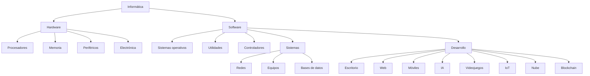

# Informatica
Manual introductorio a la informática

# IFCD0310 : Administrador de Datos

## MF0223_3: Sistemas operativos y aplicaciones informáticas (170 horas)
### UF1465: <a href="https://docs.google.com/presentation/d/1hzcE0yNG10OiP0ubMWJ0HkIMmpMwtSNBl-lrj2fcLVQ/edit?usp=sharing">Computadores para bases de datos</a> (60 horas) 
### UF1466: Sistemas de almacenamiento (70 horas) 
### UF1467: Aplicaciones microinformáticas e Internet para consulta y generación de documentación (40 horas) 
## MF0224_3: Administración de sistemas gestores de bases de datos (200 horas) 
### UF1468: Almacenamiento de la información e introducción a los SGBD (50 horas) 
### UF1469: SGDB e instalación (70 horas) 
### UF1470: Administración y monitorización de los SGBD (80 horas) 
## MF0225_3: Gestión de bases de datos (200 horas) 
### UF1471: Bases de datos relacionales y modelado de datos (70 horas) 
### UF1472: Lenguajes de definición y modificación de datos SQL (60 horas) 
### UF1473: Salvaguarda y seguridad de los datos (70 horas)

